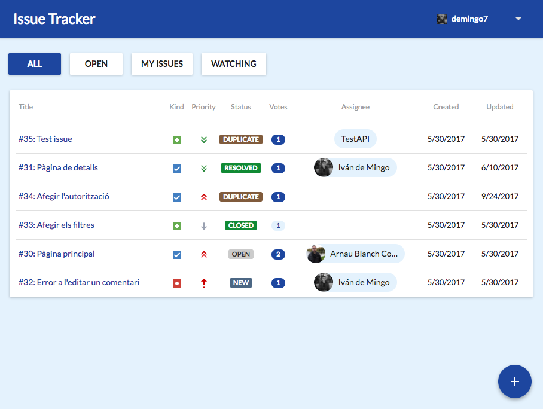
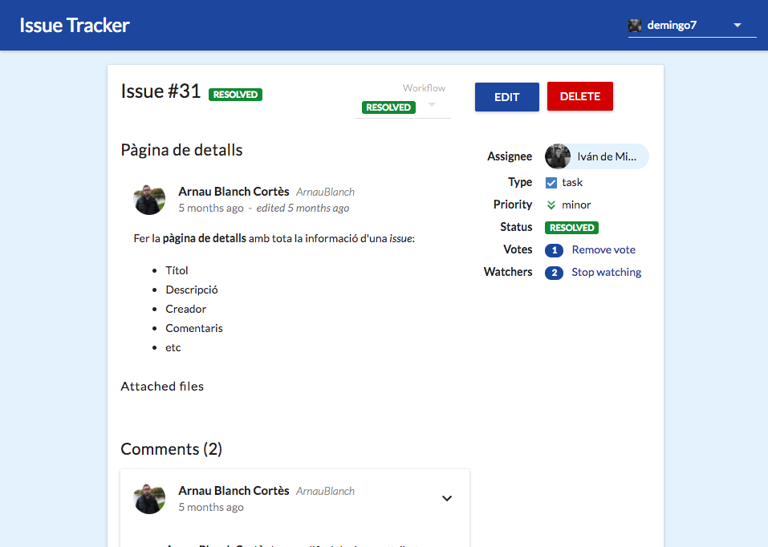
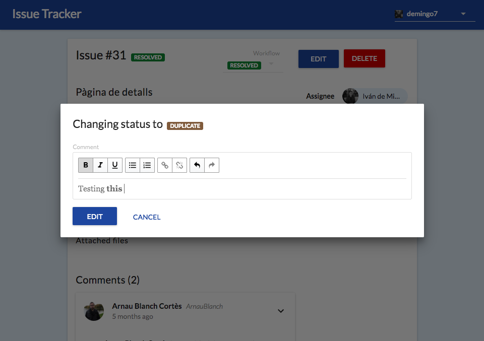
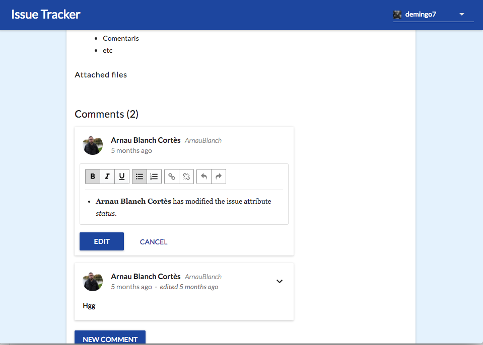
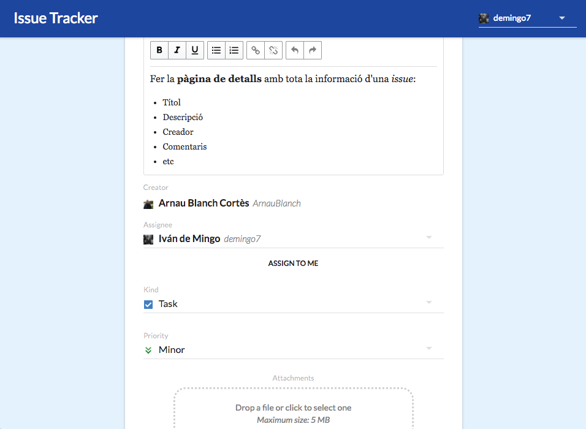

# Issue Tracker
Web-based issue tracker inspired by Bitbucket's repo issue tracker. This was done as a project for [Web Services and Applications](https://www.fib.upc.edu/en/estudis/graus/enginyeria-informatica/pla-destudis/assignatures/ASW) at UPC BarcelonaTech - Barcelona School of Informatics by [@IvanDeMingo](https://github.com/IvanDeMingo) and [@ArnauBlanch](https://github.com/ArnauBlanch).

It allows to use two mock users. You can create, see, edit, delete, comment, vote and watch issues. It features a responsive UI and a rich text editor for comments and issue's details.

**Live demo:** http://issuetracker-react.herokuapp.com/

**Screenshots**

  
  
  
  
  

It was developed using React, Redux (+ redux-saga) and material-ui. The web client internal design is described in Catalan [here](https://github.com/ArnauBlanch/IssueTrackerG12B-React/blob/master/docs/tercer_lliurament.pdf).

It uses an API (https://github.com/felixarpa/IssueTrackerG12B) developed in the previous parts of the project which is hosted at https://issue-tracker-g12b.herokuapp.com, API specification in Swagger can be seen [here](https://github.com/felixarpa/IssueTrackerG12B/blob/master/api/api.yaml).
